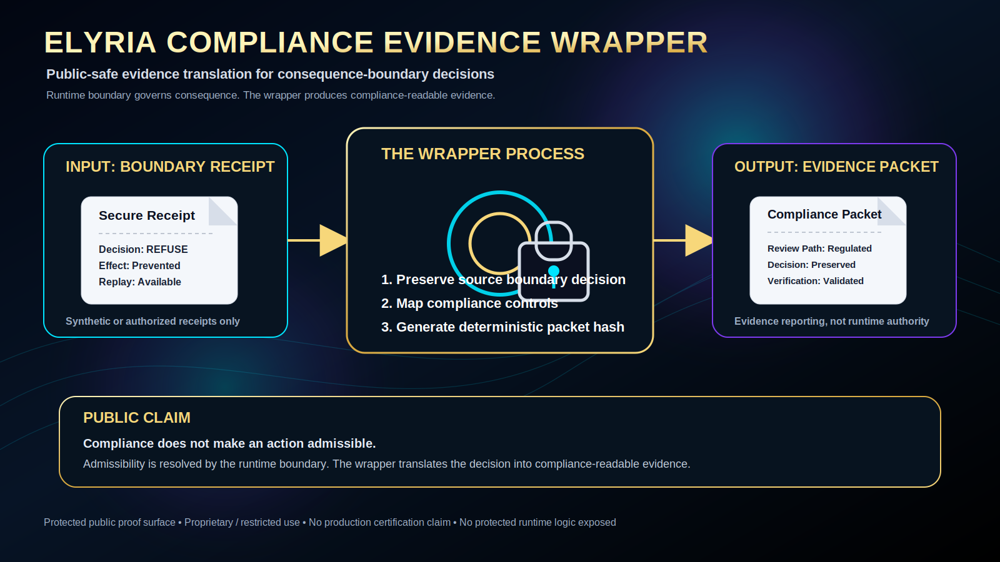

<p align="center">
  
</p>

<p align="center">
  
  
  
  
</p>

# Elyria Compliance Evidence Wrapper

Public-safe compliance evidence wrapper for Elyria consequence-boundary decisions.

This repository does not govern execution. It converts existing boundary receipts, refusals, replay results, and consequence-control outcomes into compliance, regulator, and enterprise-risk review packets.

```text
Runtime boundary decides whether consequence may bind.
Compliance wrapper translates that decision into reviewable evidence.
```

## What this is

- compliance evidence wrapper
- evidence packet generator
- control-mapping surface
- receipt-to-review translator
- public-safe proof corridor for enterprise diligence

## What this is not

- not an audit wrapper
- not the Elyria runtime boundary
- not a separate runtime authority
- not the protected runtime authority
- not financial, clinical, legal, or security advice
- not production compliance certification
- not a substitute for regulated customer review
- not a release of protected runtime logic

## Core flow

```text
boundary receipt
  -> evidence packet builder
  -> control mapping
  -> compliance evidence packet
  -> deterministic packet hash
  -> verifier
```

## Public boundary

This repository may expose:

```text
public receipt shape
synthetic examples
control mapping vocabulary
compliance packet schema
hash verification utility
review path
```

This repository does not expose:

```text
protected runtime law
private mathematical substrate
protected resolving machinery
customer policies
production adapters
private receipt internals
client-specific control mappings
credentials, secrets, or custody paths
```

## Quick start

```bash
python -m venv .venv
. .venv/bin/activate
pip install -r requirements.txt

python -m elyria_compliance_wrapper build \
  --receipt samples/boundary_receipt_refuse.json \
  --controls configs/control_map.yaml \
  --out out/refuse_packet.json

python -m elyria_compliance_wrapper verify --packet out/refuse_packet.json
```

## Decision rule

Compliance does not make an action admissible.

A compliance packet is valid only as evidence about a boundary decision that already occurred.

```text
admissibility first
evidence packet second
regulated review third
```

## Reviewer documents

| Document | Purpose |
|---|---|
| `PUBLIC_DISCLOSURE_BOUNDARY.md` | Public/private boundary and non-certification posture. |
| `COMPLIANCE_WRAPPER_MODEL.md` | Placement of the wrapper downstream of runtime admission. |
| `CONTROL_MAPPING.md` | Public synthetic control mapping examples. |
| `AUDITOR_REVIEW_PATH.md` | Regulated review path. Filename retained for compatibility. |
| `NON_PRODUCTION_NOTICE.md` | Production-use restriction and diligence requirements. |
| `LICENSE` | Proprietary evaluation license. |

## Status

Protected public proof surface. Proprietary / restricted use. Evaluation only unless separate written agreement exists.
