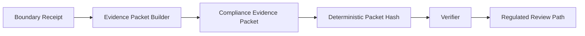

<p align="center">
  
</p>

<p align="center">
  
  
  
  
</p>

<p align="center">
  
  
  
  
</p>

<div align="center">

# Elyria Compliance Evidence Wrapper

### Public-safe evidence translation for consequence-boundary decisions

**Boundary first. Evidence wrapper second. Compliance review third.**

</div>

---

<table>
<tr>
<td width="50%">

## Position

**Elyria Compliance Evidence Wrapper** is a public-safe evidence translation proof surface.

It converts already-decided **Elyria / VERITA consequence-boundary receipts** into compliance-readable evidence packets.

</td>
<td width="50%">

## Non-negotiable boundary

- Does **not** govern execution.
- Does **not** decide admissibility.
- Does **not** authorize consequence.
- Does **not** convert refusal into permission.

</td>
</tr>
</table>

```text
runtime boundary decides whether consequence may bind
wrapper translates the decision into compliance-readable evidence
reviewer verifies the packet and determines diligence posture
```

---

## Proof surface

<table>
<tr>
<th>Surface</th>
<th>Function</th>
<th>Boundary</th>
</tr>
<tr>
<td><b>Boundary receipt</b></td>
<td>Source decision from the governed runtime boundary.</td>
<td>Input only.</td>
</tr>
<tr>
<td><b>Evidence packet</b></td>
<td>Compliance-readable record derived from the receipt.</td>
<td>Reports only.</td>
</tr>
<tr>
<td><b>Packet hash</b></td>
<td>Deterministic integrity check for review.</td>
<td>Detects change.</td>
</tr>
<tr>
<td><b>Verification command</b></td>
<td>Confirms the packet has not been altered.</td>
<td>Replay posture.</td>
</tr>
<tr>
<td><b>Regulated review path</b></td>
<td>Guides enterprise, compliance, and regulator-facing diligence.</td>
<td>Review only.</td>
</tr>
</table>

---

## Category split

<table>
<tr>
<td width="50%">

### This is

- compliance evidence wrapper
- evidence packet generator
- control-mapping surface
- receipt-to-review translator
- public-safe proof corridor for enterprise diligence

</td>
<td width="50%">

### This is not

- Elyria runtime boundary
- separate runtime authority
- protected runtime authority
- financial, clinical, legal, or security advice
- production compliance certification
- substitute for regulated customer review
- release of protected runtime logic

</td>
</tr>
</table>

---

## Core flow



```text
boundary receipt
  -> evidence packet builder
  -> compliance evidence packet
  -> deterministic packet hash
  -> verifier
  -> regulated review path
```

---

## Quick start

```bash
python -m venv .venv
. .venv/bin/activate
python -m pip install -e .

elyria-wrap build examples/boundary_receipt_refuse.json --out out/refuse_packet.json
elyria-wrap verify out/refuse_packet.json
python -m pytest -q
```

Expected output:

```text
packet written: out/refuse_packet.json
verification passed
tests passed
```

---

## Decision preservation rule

Compliance does not make an action admissible.

A compliance packet is valid only as evidence about a boundary decision that already occurred.

<table>
<tr>
<th>Boundary decision</th>
<th>Wrapper posture</th>
</tr>
<tr>
<td><code>REFUSE</code></td>
<td><b>REFUSE remains REFUSE</b></td>
</tr>
<tr>
<td><code>HALT</code></td>
<td><b>HALT remains HALT</b></td>
</tr>
<tr>
<td><code>NARROW</code></td>
<td><b>NARROW remains NARROW</b></td>
</tr>
<tr>
<td><code>ESCALATE</code></td>
<td><b>ESCALATE remains ESCALATE</b></td>
</tr>
<tr>
<td><code>ADMIT</code></td>
<td><b>ADMIT remains ADMIT</b></td>
</tr>
</table>

> The wrapper reports. It does not promote, override, or soften the boundary outcome.

---

## Reviewer documents

<table>
<tr>
<th>Document</th>
<th>Purpose</th>
</tr>
<tr>
<td><code>PUBLIC_DISCLOSURE_BOUNDARY.md</code></td>
<td>Public/private boundary and non-certification posture.</td>
</tr>
<tr>
<td><code>COMPLIANCE_WRAPPER_MODEL.md</code></td>
<td>Placement of the wrapper downstream of runtime admission.</td>
</tr>
<tr>
<td><code>CONTROL_MAPPING.md</code></td>
<td>Public synthetic control mapping examples.</td>
</tr>
<tr>
<td><code>REGULATED_REVIEW_PATH.md</code></td>
<td>Regulated review path.</td>
</tr>
<tr>
<td><code>NON_PRODUCTION_NOTICE.md</code></td>
<td>Production-use restriction and diligence requirements.</td>
</tr>
<tr>
<td><code>LICENSE</code></td>
<td>Proprietary evaluation license.</td>
</tr>
</table>

---

## Status

<p align="center">
  
  
  
  
</p>

Evaluation only unless a separate written agreement exists.
